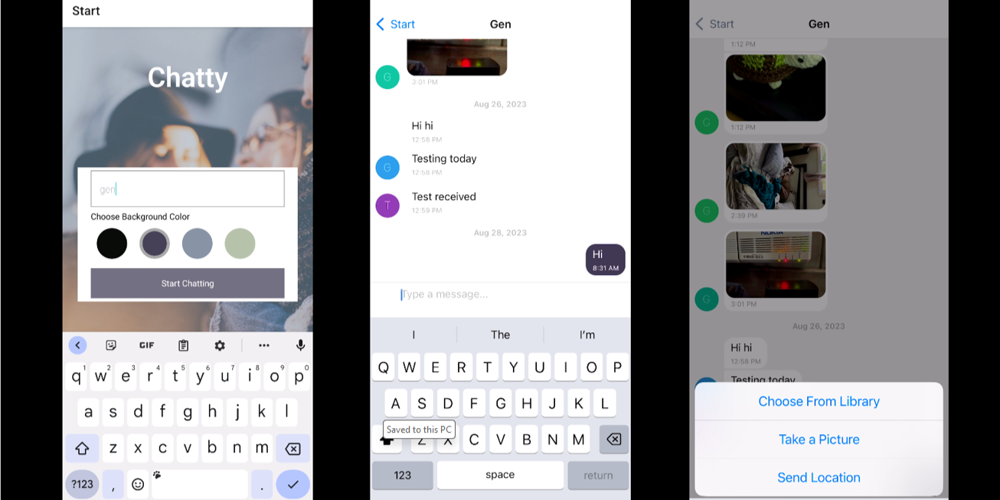

# Chatty

Provides users with a chat interface and options to share images and their location

1. Enter your name
2. Select a background color for your text box
3. Hit "Start Chatting"

### Features

The action button (+) on the left of the chat input box allows you to:

- Send photos from your library
- Take photos and send
- Send your location

### Tech Stack

- React Native
- Firestore Database
- Firebase Storage & Authentication for anonymous sign-in
- Node.js
- Expo
- React Native Maps
- React Native Gifted Chat

### Setup

1. Fork the repo
2. Create a firebase project and register the web app to get your credentials
3. Replace the firebaseConfig info in App.js with your own credentials
4. Download the expo app on your phone and on your computer
5. Register an account with expo on their website
6. In your project, run "expo start" or "npm start"
7. With the expo app open on your phone, you should be able to see the development server running for the chat app

### User Stories

● As a new user, I want to be able to easily enter a chat room so I can quickly start talking to my
friends and family.
● As a user, I want to be able to send messages to my friends and family members to exchange
the latest news.
● As a user, I want to send images to my friends to show them what I’m currently doing.
● As a user, I want to share my location with my friends to show them where I am.
● As a user, I want to be able to read my messages offline so I can reread conversations at any
time.
● As a user with a visual impairment, I want to use a chat app that is compatible with a screen
reader so that I can engage with a chat interface.
